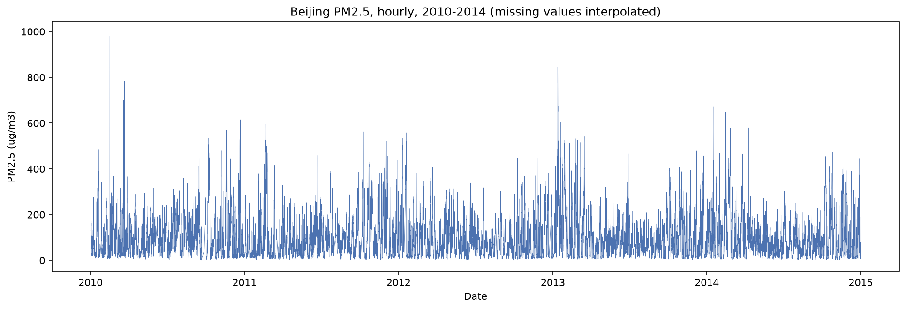
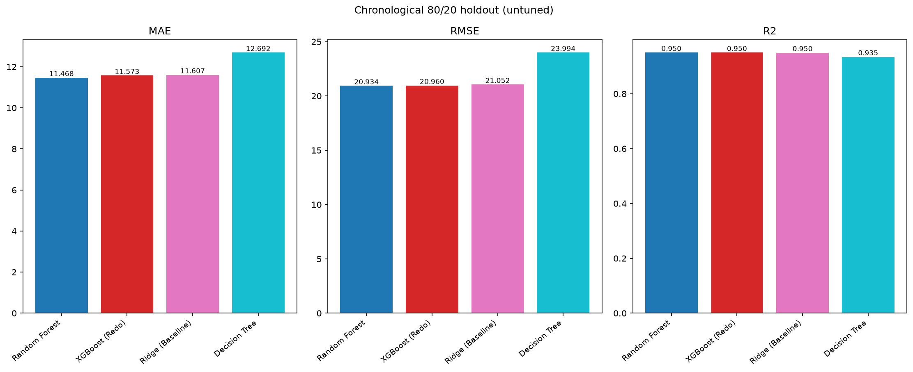
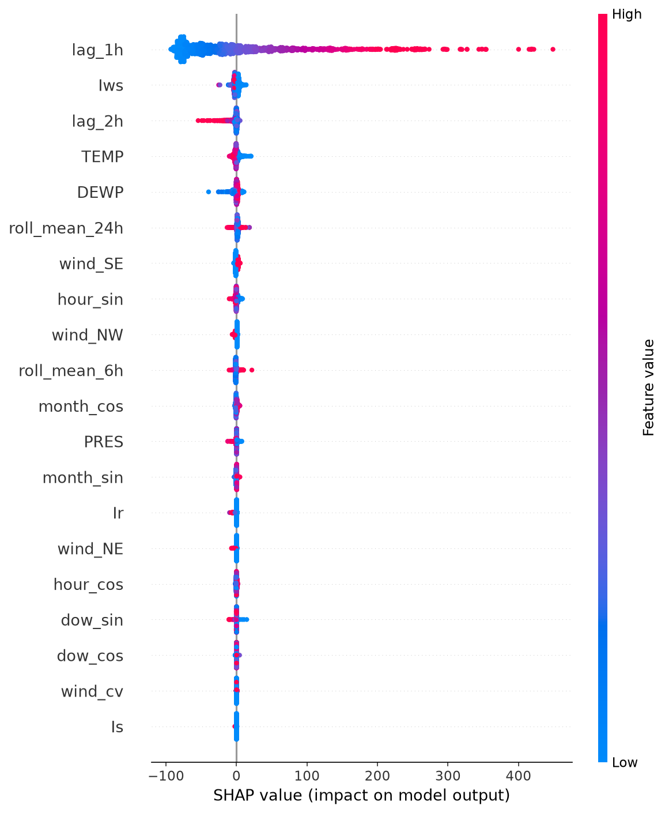
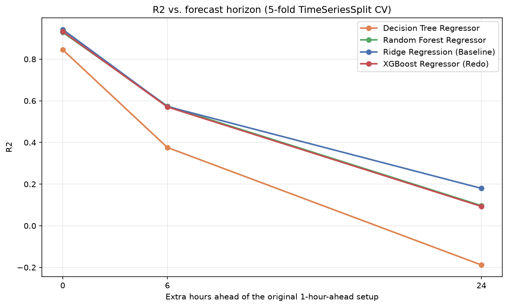
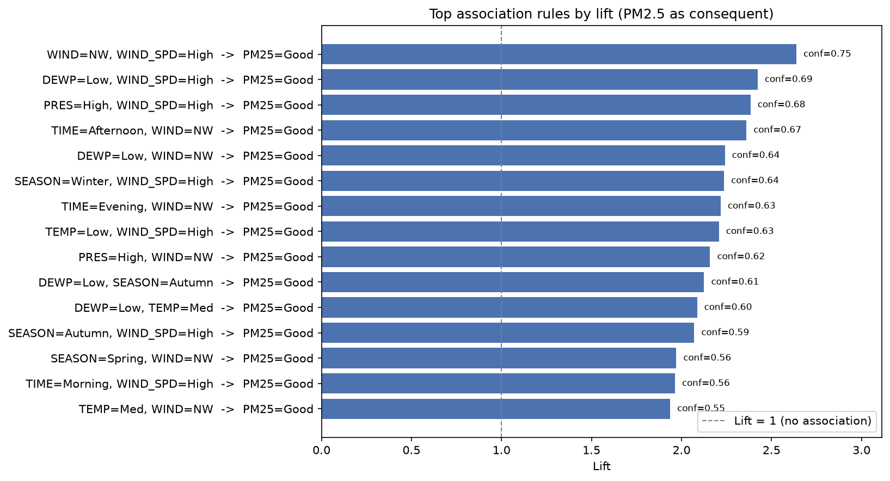
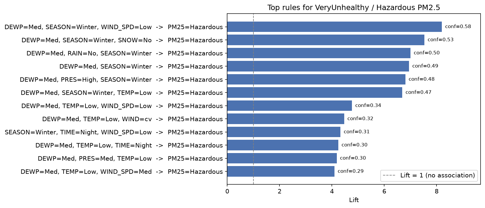

# Beijing PM2.5 - Forecasting and Pollution-Driver Analysis

Redo of [Dieselmarble/Beijing-PM2.5-Forecasting](https://github.com/Dieselmarble/Beijing-PM2.5-Forecasting), built for a Data Mining course project. The original project forecasts Beijing PM2.5 levels with Ridge/Lasso regression. This version keeps the forecasting task but adds a proper 4-model benchmark, hyperparameter tuning, SHAP explainability, and a second analysis using association rule mining to find out *what actually drives* a pollution spike.

## Dataset

UCI "Beijing PM2.5 Data" - about 43,800 hourly readings (2010-2014) combining PM2.5 levels with weather data (temperature, dew point, pressure, wind, rain/snow).

Chen, S. (2015). Beijing PM2.5 Data. UCI Machine Learning Repository. https://doi.org/10.24432/C5JS49



## Part 1: Forecasting

Four models were benchmarked on 1-hour-ahead PM2.5 forecasts: Ridge as the baseline, Decision Tree, Random Forest, and XGBoost. Validation uses `TimeSeriesSplit` instead of a random shuffle, since shuffling would leak future rows into training on time-series data.



The tree-based models edge out Ridge, but barely - paired significance tests (t-test and Wilcoxon) across folds show the difference isn't distinguishable from noise. Hyperparameter tuning doesn't change that.

SHAP shows why: the previous hour's PM2.5 reading dominates every other feature. Pollution barely moves hour to hour, so there's not much signal left for a more expressive model to use.



Forecasts were also run at 6-hour and 24-hour horizons, where the previous reading is less useful and the models have more room to separate.



The gap between models does widen at longer horizons, once the "copy last hour" shortcut stops working.

## Part 2: What Drives Pollution Spikes?

Since hour-to-hour prediction plateaus fast, the second half asks a different question: which weather and time conditions co-occur with bad air? This uses association rule mining (Apriori, implemented from scratch) over PM2.5 severity bands and discretized weather features, ranked by **lift** - how much more likely an outcome is given a condition, versus its baseline rate.



Strong wind is the top predictor of good air across the board. Good-air rules dominate the overall top-lift ranking, so hazardous readings - a rarer band - need their own pass with a lower support threshold to show up.



Calm, humid winter conditions are linked to hazardous PM2.5 at roughly **8x** the base rate - Beijing's winter smog pattern: cold, windless air trapping emissions close to the ground.

## Project Structure

```
data/            raw dataset
src/             all analysis code, split by stage
outputs/         charts and result tables, one folder per stage
main.py          runs the full pipeline end to end
```

## Running it

```
pip install -r requirements.txt
python main.py
```

Takes a few minutes, mostly for hyperparameter tuning. All charts and tables get written to `outputs/`.
